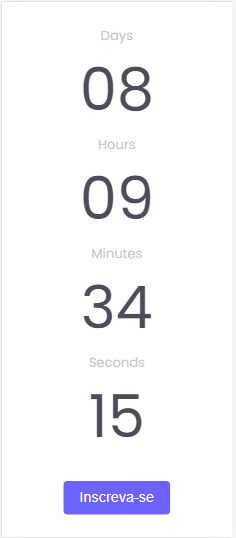
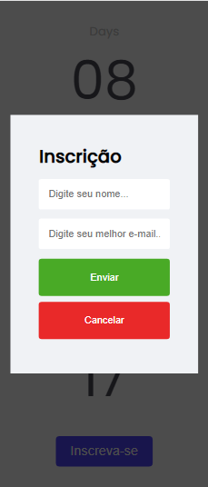

<h1 align='center'>Countdown</h1>

  <a href="#-sobre">Sobre</a>&nbsp;&nbsp;&nbsp;|&nbsp;&nbsp;&nbsp;
  <a href="#-prints">Prints</a>&nbsp;&nbsp;&nbsp;|&nbsp;&nbsp;&nbsp;
  <a href="#-tecnologias">Tecnologias</a>&nbsp;&nbsp;&nbsp;|&nbsp;&nbsp;&nbsp;
  <a href="#-licença">Licença</a>&nbsp;&nbsp;&nbsp;|&nbsp;&nbsp;&nbsp;

🚀 Projeto concluído ✅

## 💻 Sobre

Este projeto é um contador regressivo feito em HTML, CSS e JavaScript puro. A partir de uma data fixa no código o contador é iniciado e ele mostra o tempo restante desde a data atual até a data estipulada; além disso, é possível que o usuário digite seu nome e e-mail em um formulário para simular uma inscrição; após enviar o formulário se os dados estiverem corretos, eles serão exibidos na tela do usuário.  
O projeto é mais um desafio do Curso Discover da Rocketseat, sendo que o intuito é colocar em prática conhecimentos aprendidos durante o curso. [Link para página do desafio](https://efficient-sloth-d85.notion.site/Desafio-Countdown-4572ce6f5c91469abe0171f454a13e3f) 

## 📷 Prints

 
 

## 🛠 Tecnologias

- Linguagens: 
    - [HTML](https://developer.mozilla.org/pt-BR/docs/Web/HTML) 
    - [CSS](https://developer.mozilla.org/pt-BR/docs/Web/CSS)
    - [Javascript](https://www.javascript.com/)
- Ferramentas / Recursos: 
    - Editor: [Visual Studio Code](https://code.visualstudio.com/)
    - Fontes: [Poppins](https://fonts.google.com/specimen/Poppins?query=Poppins)

## 📝 Licença 

O projeto está sob a [Licensa MIT](./LICENSE) 

Qualquer pessoa pode usar, clonar e contribuir com este projeto 👍😁 

